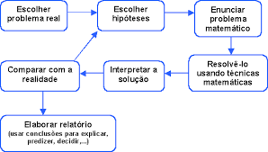

# texto-markdown
repositório para lição 04
## 1.1 Modelagem Matemática
###  1.2 A Modelagem  Matemática na sala de aula
A respeito do que vem a ser Modelagem Matemática, segundo Barbosa (2009, p. 17),
>De modo geral, essa expressão significa a abordagem de situações do dia a dia ou das  ciência (Biologia, Economia, Física et.) por meio da Matemática.

Isso significa que situaações, fatos reais, são tomados como ponto de partida para abordagem de conteúdos matemáticos. O autor ainda ressalta  que o uso da modelagem **pode  levar o aluno a retomar conhecimentos anteriores e discutir esses conceitos**. Além disso, a modelagem pode favorecer debates que extrapola  a própria  _Matemática_.

Temos três situações de modelagem possíveis:
- O professor coleta dados de uma situação real, formula o problema e o aluno resolve o problema
-  O professor coleta os dados, mas cabe ao aluno formular e resolver o problema
-  O aluno coleta os dados, formula e resolve o problema
Assim, o aluno pode desempenar uma  atividade matemática cada vez maior, a depender da escolha do professor, conforme a tabela

|Elaboração do problema|Coleta de dados|Resolução do problema|Nível|
|----------------------|---------------|--------------------|-----|
|Professor|Professor|Aluno|1|
|Professor|Aluno|Aluno|2|
|Aluno| Aluno| Aluno| 3|

Observe na figura a seguir um esquema que caracteriza bem  a atuação do aluno no desenvolvimento do terceiro nível da `modelagem matematica`.

Você pode  visualisar o texto de Barbosa (2009) clicando aqui [texto de Barbosa](http://sbem.iuri0094.hospedagemdesites.ws/revista/index.php/emr/article/view/5/5)
